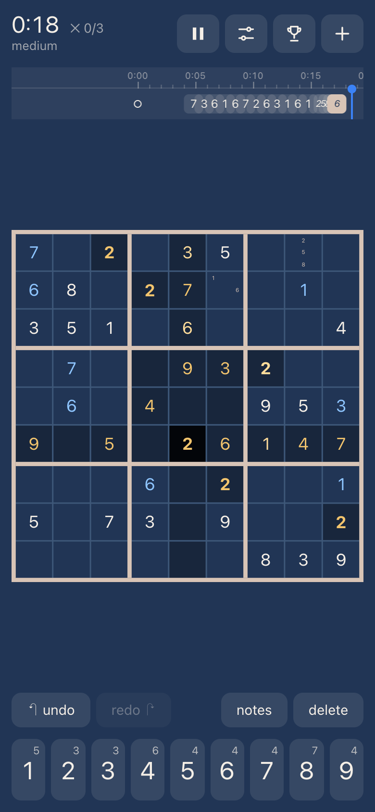

# Sudoku

A sudoku for your phone that works anywhere, even without a connection. Free, open source, and without accounts, ads or tracking.

**[Play it at sudoku.yunusozturk.de](https://sudoku.yunusozturk.de)** · [Source](https://git.yunusozturk.de/yunus/sudoku)

<p align="center">
  
</p>

## Why this one

- **Free and open source.** MIT licensed, no ads, no subscription, no account. Your games, scores and settings stay on your device and never go anywhere else.
- **Works offline.** Add it to your home screen and it runs like an app, with or without internet.
- **Endless puzzles, honestly rated.** Every puzzle is generated on your device and has exactly one solution. Its difficulty (easy, medium, hard, expert) comes from the solving techniques a human needs, not from counting the given numbers.
- **Watch your best games again.** Your ten best times per difficulty are kept move by move. Replay them with play and pause, step through single moves, or speed up to 8×.
- **Play your way.** Notes that step aside once a placed number rules them out, undo and redo, and a timeline of every move to jump back to any point. Mistakes can be marked with a limit of 3, 5 or none, or left unmarked, like on paper.
- **Picks up where you left off.** Leave in the middle of a game and it pauses itself. Come back days later and continue.
- **Make it yours.** Three themes, every colour, font and size adjustable with a live preview, and the option to highlight all cells with the selected number.

## Install it

Open the game once while online, then:

- **iPhone and iPad:** in Safari, tap Share, then Add to Home Screen.
- **Android:** in Chrome, open the menu and tap Install app.
- **Desktop:** in Chrome or Edge, click the install icon in the address bar.

Installing also keeps your scores safe: browsers such as Safari may delete a website's stored data after a week without a visit, but not that of an installed app.

It needs a current browser: Safari on iOS 17 or later, or a recent Chrome, Edge or Firefox.

On a keyboard, the controls work like a video player: J undoes, K or Space pauses and resumes, L redoes. Digits enter numbers, Backspace deletes and the arrows move. In a replay, J and L step through the moves, K or Space plays and pauses, the arrows step as well and Escape leaves.

## Privacy

Everything you do stays on your device: there are no accounts, no cookies, no analytics and no requests to other services. The servers delivering the game keep the usual access logs. The full legal notice and privacy statement are at [sudoku.yunusozturk.de/legal](https://sudoku.yunusozturk.de/legal), and in the game under Settings, About.

## Known limitations

The board is drawn on a canvas, so screen readers can't read it yet.

## Under the hood

The game doubles as an experiment in writing a frontend with as few moving parts as possible. These are the rules it follows:

- **One stream of actions, one fold.** Every input is an action in a single RxJS stream: taps, keys, the app going to the background, a replay loaded from storage. The entire state is `actions$.pipe(scan(reducer))`, and nothing else ever changes it.
- **Pure functions over immutable data.** The reducer and all game logic are plain functions: `(state, action, time) => state`. Side effects such as storage live in separate effect streams at the edge, never in the reducer.
- **Time is recorded, not ticked.** Every action carries the moment it happened, and the timer stores moments instead of counting. Elapsed time is a function of the state and a point in time. No interval ever ticks the state; the clock on screen and the replay each schedule themselves to exactly the next second or the next move.
- **A game is its moves.** The board, the notes, undo and redo, the timeline and replays are all the same thing: the puzzle with its list of moves folded up to a cursor. A replay is that fold, driven by playback time instead of the player.
- **View and logic strictly apart.** Rules live in plain TypeScript modules with tests. Components only draw what they are given. The board is a single `<canvas>` drawn from one config object, with no state derived from it.
- **Everything configurable.** Colours, sizes, fonts, replay speeds, limits and key bindings are settings, not constants buried in drawing code.
- **Types at the boundaries.** Anything read from storage passes typed guards (`isShape`, `isOneOf`, …) before it becomes a value. There are no type assertions on stored data.
- **Never blocking the screen.** New puzzles are generated and rated in a Web Worker, so even a hard one, which can take a second or two on a phone, never freezes the game.
- **Small enough to keep everything.** A finished game, with every move and its timing, packs into a few hundred characters of base64url. All of it lives in `localStorage`, and a service worker keeps the app itself available offline.

Built with Angular 22 (zoneless, standalone components), RxJS and TypeScript, tested with Vitest, and served as static files by nginx.

## Development

```bash
nvm use
npm install
npm start
```

Open `http://localhost:4200/`. To try it on a phone in the same network, serve on all interfaces and allow your address:

```bash
NG_ALLOWED_HOSTS=localhost,<your-ip> npx ng serve --host 0.0.0.0
```

| Command          | Does                                           |
| ---------------- | ---------------------------------------------- |
| `npm test`       | runs the tests                                 |
| `npm run lint`   | checks the code with ESLint (angular-eslint)   |
| `npm run format` | formats everything with Prettier               |
| `npm run build`  | builds static files into `dist/sudoku/browser` |

```
src/app/
  logic/       game rules, generator, difficulty rating, replay, encoding
  components/  board canvas, timeline, controls and sheets
  pages/       the page: action streams, reducer and effects
  theme/       theme settings and presets
  settings/    player preferences
  core/        storage, validation and small utilities
deploy/        Dockerfile and nginx configuration
```

## Deployment

Every push to `main` is checked (formatting, lint, tests) and then published as a Docker image for amd64 as `git.yunusozturk.de/yunus/sudoku`, tagged `latest`. Version tags such as `v1.0.0` publish it as `1.0.0` as well. The image serves the static build with nginx as a non-root user on port 8080, with a strict Content Security Policy and further security headers:

```bash
docker run --rm -p 8080:8080 git.yunusozturk.de/yunus/sudoku
```

To build it yourself:

```bash
docker build -f deploy/Dockerfile -t sudoku .
```

The build output is plain static files, so any web server works as well.

## License

[MIT](LICENSE)
